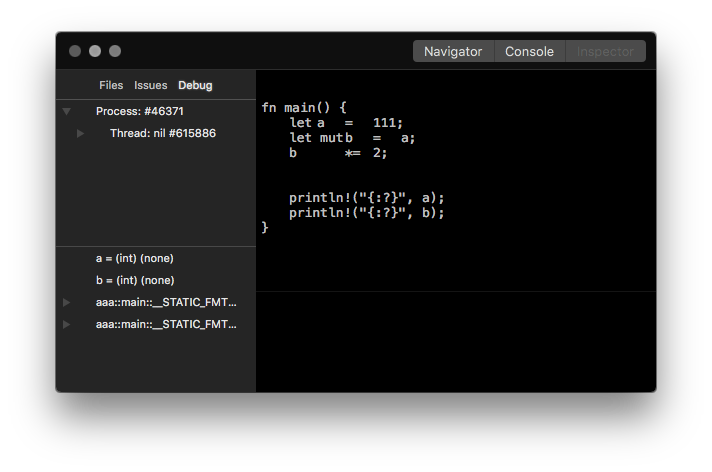

(Under development...)

To Do
-----
- Creating a new workspace.
- Project file list saving.
- Pretty display of stacks and variables in debugging UI.
- Drag & drop support in project file tree pane. 
- Cargo output parsing and display. (via Unix pipe)
- Racer output parsing and display. (via Unix pipe)
- Racer autocompletion GUI support.

There're many more, but I'll think about them later after I finish these jobs.

